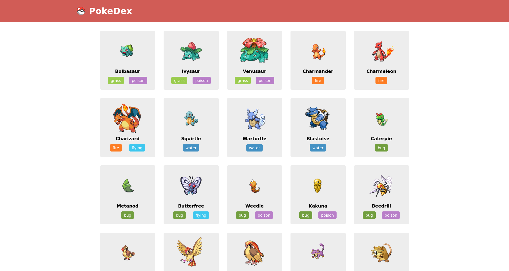
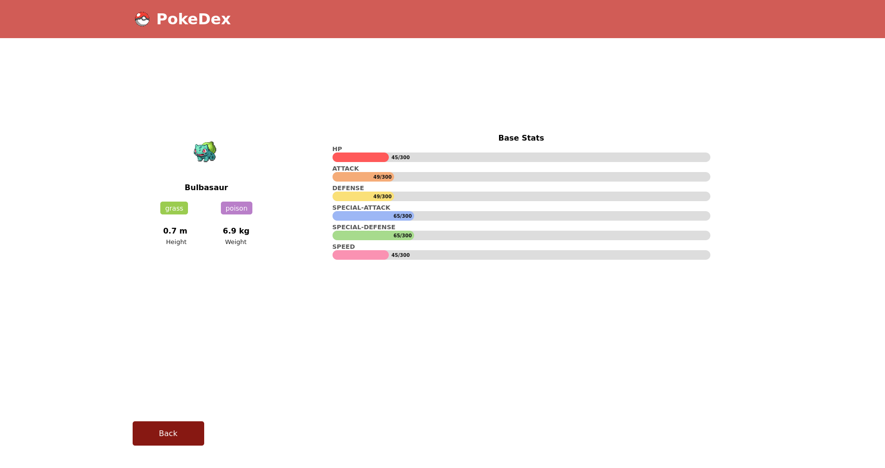

# Pokedex

Pokedex is a small responsive React app that shows pokemon info using [PokeAPI](https://pokeapi.co/) with pagination and routing.

## Installation and Setup Instructions

In the project directory, you should run:

### `yarn` or `npm install`

To install depencencies

### `yarn start` or `npm start`

Runs the app in the development mode.\
Open [http://localhost:3000](http://localhost:3000) to view it in the browser.

The page will reload if you make edits.\
You will also see any lint errors in the console.
